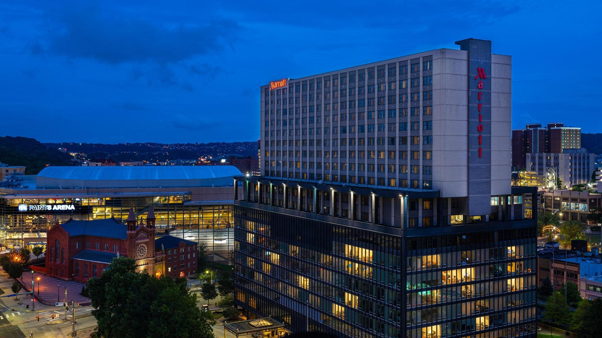

The workshop will take place at the Pittsburgh Marriott City Center. The entire program will take place at the hotel. A room block has been arranged for the workshop at the hotel. You can reserve your room using [this link](https://www.marriott.com/event-reservations/reservation-link.mi?id=1729172649523&key=GRP&guestreslink2=true).

---

---

The hotel is located in the heart of downtown Pittsburgh. PPG Paints Arena, the home of the Pittsburgh Penguins is across the street from the hotel. Pittsburgh's cultural district which hosts  major theater, dance, opera, and orchestral performance is also within close walking distance. Duquesne University is within next door, University of Pittsburgh is two miles east, and Carnegie Mellon is three miles east. 

<!-- Ultricies lacus sed turpis tincidunt. -->
